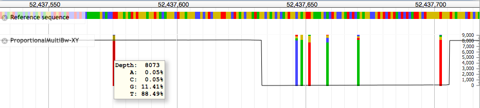

# ProportionalMultiBw

JBrowse plugin to display multiple BigWig tracks as a stacked proportion of depth.

[](https://travis-ci.org/cancerit/proportionalmultibw) : master
[](https://travis-ci.org/cancerit/proportionalmultibw) : develop

`ProportionalMultiBw` is based on [MultiBigWig](https://github.com/elsiklab/multibigwig).  Significant credit and thanks are due to [Colin Daiesh](https://github.com/cmdcolin) for help and guidance.

## Install

Unpack the release into the plugins directory of JBrowse.  The folder must be
named:

```
$JBROWSE_ROOT/plugins/ProportionalMultiBw
```

After unpack you should be able to see:

```
$JBROWSE_ROOT/plugins/ProportionalMultiBw/img/zoom_in.png
```

(sorry, limitations of finding the resource, get in touch if you have a solution)

## Associated software

Data files for use in this tool can be generated using the C package [cgpBigWig](https://github.com/cancerit/cgpBigWig).

## Available plots

### ProportionalXYPlot

`ProportionalXYPlot` provides a track able to read a set of BigWig files to produce a stacked proportion bar plot for each position.

This expects 2 or more BigWig files:

1. BigWig containing counts of total data at a position, e.g.
    * Total read depth
    * Patients screened
2. 1 or more BigWig files of fractional data (sum of a position should equal 1), e.g.
    * Allele fration (4 bw files, A, C, G, T)
    * Patients `+ve`/`-ve` for a kmown somatic mutation

The `bw` files for fractional data should not contain `0` values.

Using this set of files an allele stack is rendered proportional to the allele fractions (full height of the track) and the depth overlaid.

#### Configuration - Allele fraction

Allele stacks are only rendered if the position matches reference below the default threshold of `0.9`, this is configurable both in base configuration and via a track menu option.



```js
{
  // standard Wiggle options
  "storeClass"     : "ProportionalMultiBw/Store/SeqFeature/ProportionalMultiBw",
  "type"           : "ProportionalMultiBw/View/Track/ProportionalWiggle/ProportionalXYPlot",
  "label"          : "ProportionalMultiBw-XY",
  "scale"          : "linear",
  "yScalePosition" : "right",
  // content of ACGT urlTemplates matched against ref
  "matchRef"       : true,
  // Stacks hidden if reference allele exceeds this fraction
  "maxRefFrac"     : 0.9,
  // Optional labels to apply to mouseovers, falls back to 'name'
  "labels" : {
    "counts"       : "Depth"
  },
  "urlTemplates"   : [
    // Data for raw count, e.g. total sequencing depth
    // MUST be present
     { "url"  : "bw/SAMPLE.bam.bw",
       "name"  : "counts",
       "color" : "black"
     },
     // Data files for allele fractions
     { "url"   : "bw/A.SAMPLE.bam.bw",
       "name"  : "A",
       "color" : "#00BF00"
     },
     { "url"   : "bw/C.SAMPLE.bam.bw",
       "name"  : "C",
       "color" : "#4747ff"
     },
     { "url"   : "bw/G.SAMPLE.bam.bw",
       "name"  : "G",
       "color" : "#d5bb04"
     },
     { "url"   : "bw/T.SAMPLE.bam.bw",
       "name"  : "T",
       "color" : "#f00"
     }
  ]
}
```

For high depth regions the log scale is preferable:


```js
{
  ...
  "scale": "log",
  ...
}
```

By default only positions with less than 90% match to reference are shown.  A track menu item allows this to be modified:


E.g. modified to 0.92:


Zooming out to less than 1px per b.p. results in the fraction stacks being disabled:


#### Configuration - Non-ref matched stacks

A minor change to the configuration allows stacks to be generated based on presence of data alone rather than how they diverge from reference alleles.  This can be used for population statistics such as comparing the number of patients presenting with a SNP vs. the number screened.

Changes to the config would be along the lines:

```js
{
  ...
  // Disable matching of non 'count' data against reference.
  "matchRef" : false,
  // Data files for allele fractions
  "urlTemplates" : [
    { "url"   : "bw/donors_screened.bw",
      "name"  : "counts",
      "color" : "black"
    },
    { "url"   : "bw/pos.bw",
      "name"  : "pos",
      "color" : "#00BF00"
    },
    { "url"   : "bw/neg.bw",
      "name"  : "neg",
      "color" : "#4747ff"
    },
  ],
  "labels" : {
    "counts" : "Screened",
    "pos"    : "+ve",
    "neg"    : "-ve",
  }
  ...
}
```

### ProportionalDensity

At present this has not been modified from the original base taken from [https://github.com/elsiklab/multibigwig](MultiBigWig).  The intent is to give a produce a single density plot showing hotspots of divergence from reference.

--

## Why?

Over the last few years it has been common to generate whole genome sequencing (WGS) data
around 30-50x deep.  Even standard whole exome sequencing (WXS) is rarely over 100x and
JBrowse can display these reasonably well.

Within our group we are more regularly carrying out amplicon sequencing experiments (targeted pulldown)
with depth in the 1000s causing visualisation of the profile of errors/mutations in a region difficult.

Even in WGS, due to the new XTen Illumina machines, more high depth experiments are being run to detect
improve sensitivity to subclonal events in cancer genomes.
